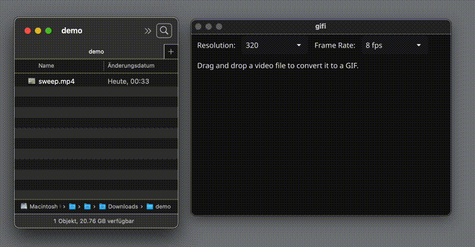

# gifi



App which allows you to directly convert a .mp4, .mov, .mkv or .avi to a gif and save it in same folder.

## macOS Setup

```sh
brew intall ffmpeg
```

## Windows Setup

1. Download FFmpeg from https://ffmpeg.org/download.html
2. Extract the files
3. Add the ffmpeg/bin folder to your System PATH
   - Open System Properties > Advanced > Environment Variables
   - Under System Variables, find PATH
   - Add the full path to ffmpeg/bin folder
4. Restart your system

---

## Build for macOS

```sh
brew install ffmpeg
```

Link it

```sh
sudo ln -sf /opt/homebrew/bin/ffmpeg /usr/local/bin/ffmpeg
```

```sh
go mod tidy
go install fyne.io/fyne/v2/cmd/fyne@latest
export PATH=$PATH:$HOME/go/bin
fyne package -os darwin -icon icon.png -appID com.eliasalerno.gifi -name gifi
```

## Build for Windows (on macOS)

> Hint: you must have docker installed & the daemon must be running

```sh
# Install MinGW-w64 & FFmpeg using Homebrew
brew install mingw-w64
brew install ffmpeg
```

```sh
go mod tidy
go install fyne.io/fyne/v2/cmd/fyne@latest
go install github.com/fyne-io/fyne-cross@latest

export PATH=$PATH:$HOME/go/bin

go clean -cache -modcache

fyne-cross windows -arch=amd64 -icon icon.png -app-id com.eliasalerno.gifi -name gifi
```

## Dependencies

- FFmpeg
- Fyne CLI
- gcc

## for cross compilation

- Docker
- fyne-cross
